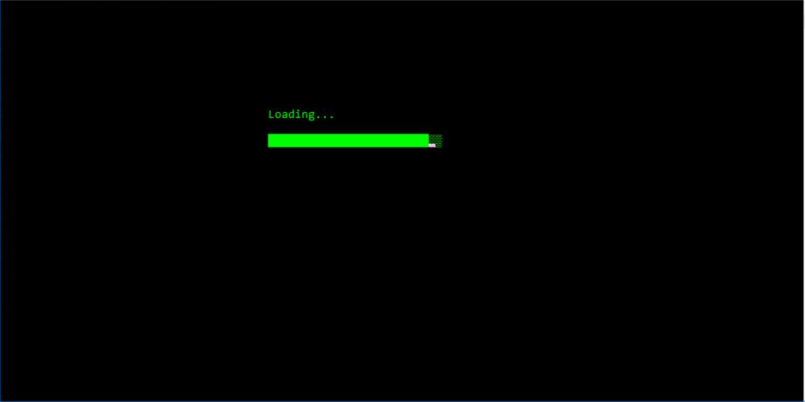

# TicTacToe
A game of tic tac toe with two opponents

We all already play the TicTacToe game. Here we proposed a C++ mini-program to play that game. 

## Loading animation

## Menu and player names

## Exemple of gameplay

## Example of a winning scenario
